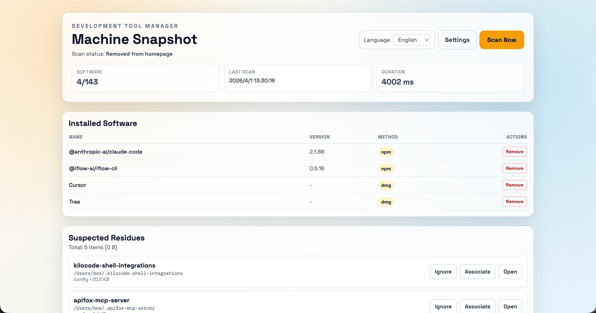
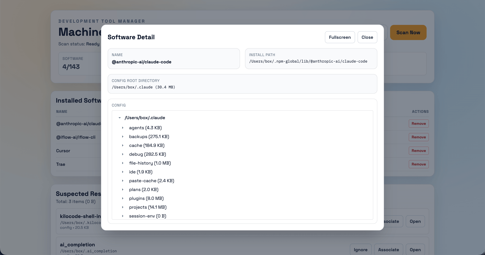
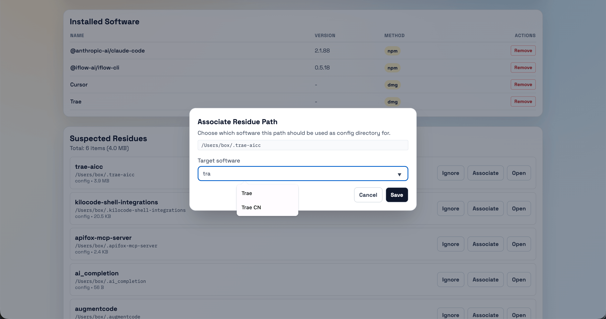
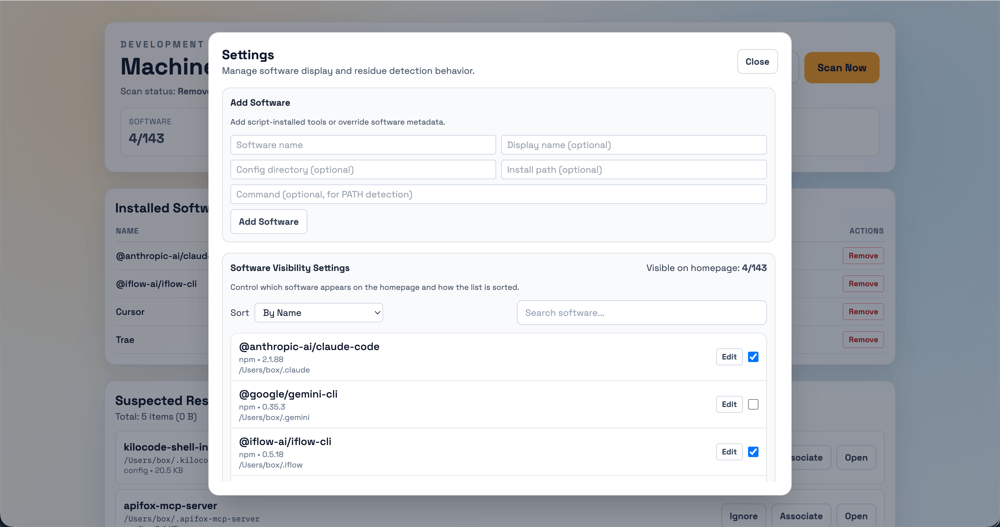
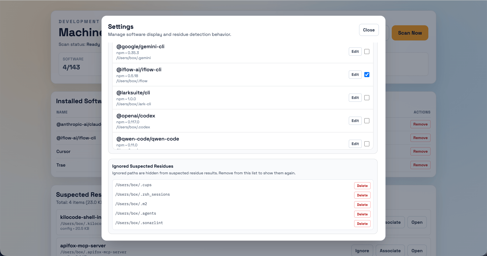

[中文版](./README.md) | [English](./README.en.md)

# Dev Tool Manager

A professional local dashboard for macOS developers to catalog, manage, and clean up the footprints of their AI programming tools (and other CLI utilities).

## 🚀 Overview

In the era of rapid AI tool evolution, developers often find themselves trialing numerous AI assistants (Claude Code, Cursor, Windsurf, Aider, etc.). These tools often leave behind configuration files, history, and cached models that clutter your home directory. 

**Dev Tool Manager** automates the discovery of these tools across your system, provides a unified dashboard for their configurations, and helps identify orphaned "residues" from uninstalled software—giving you back control of your disk space.

<div style="display:flex;overflow-x:auto;gap:1rem;margin:1rem 0;">
  
  
  
  
  
</div>

## ✨ Key Features

- **Automated Discovery**: Scans `/Applications`, Homebrew, npm, pip, and your `PATH` to find installed tools.
- **AI Tool Intelligence**: Built-in support for Claude Code, Cursor, Windsurf, Continue, Aider, Tabnine, Codeium, Supermaven, and more.
- **Residue Detection**: Identifies suspected configuration folders belonging to software no longer installed.
- **Interactive Configuration**: View file trees, copy config paths, and open directories directly in Finder or Terminal.
- **Smart Association**: If a tool is installed via a script or binary, you can manually associate its configuration path for tracking.
- **Multi-lingual**: Fully localized in English and Simplified Chinese.

## 🛠 Prerequisites

- **macOS** (Architecture-aware for Intel and Apple Silicon)
- **Node.js 18+**
- **npm** (for package management)

## 📦 Quick Start

```bash
# Clone the repository
git clone https://github.com/mr-box/dev-tool-manager.git
cd dev-tool-manager

# Install dependencies and start
npm install
npm run dev
```

Visit `http://localhost:5173` to view your dashboard.

## ⚙️ Configuration

Copy `.env.example` to `.env` to customize your environment:

| Variable | Description | Default |
| --- | --- | --- |
| `CLIENT_PORT` | Vite development server port | `5173` |
| `SERVER_PORT` | Fastify API server port | `3456` |
| `SERVER_HOST` | Bind address for the backend | `127.0.0.1` |
| `CORS_ORIGIN` | Comma-separated allowed origins | standard local ports |

## 📂 Project Structure

```text
dev-tool-manager/
├── client/              # React frontend (Vite + Tailwind CSS + i18next)
│   ├── src/components/  # UI components (Modals, Tables, Lists)
│   ├── src/api.ts       # Backend service layer
│   └── src/utils.ts     # Frontend formatting and UI helpers
├── server/              # Fastify backend
│   ├── scanner/         # High-level scanner orchestration
│   │   ├── index.ts     # Aggregation and deduplication logic
│   │   └── scanners/    # Plugin-based scanners (Homebrew, npm, pip, etc.)
│   ├── residues.ts      # Heuristic-based residue detection
│   └── settings.ts      # Persistence for user preferences
├── shared/              # Shared types and normalization logic
├── scripts/             # Concurrent dev-mode bootscripts
└── tests/               # Native Node.js test suites
```

## 🤝 Contributing

We welcome contributions! Please check the [Contributing Guide](./CONTRIBUTING.md) for more details.

## 📄 License

Distributed under the MIT License. See `LICENSE` for more information.

---
*Note: This tool is intended for local management. The backend binds to `127.0.0.1` by default for security.*
