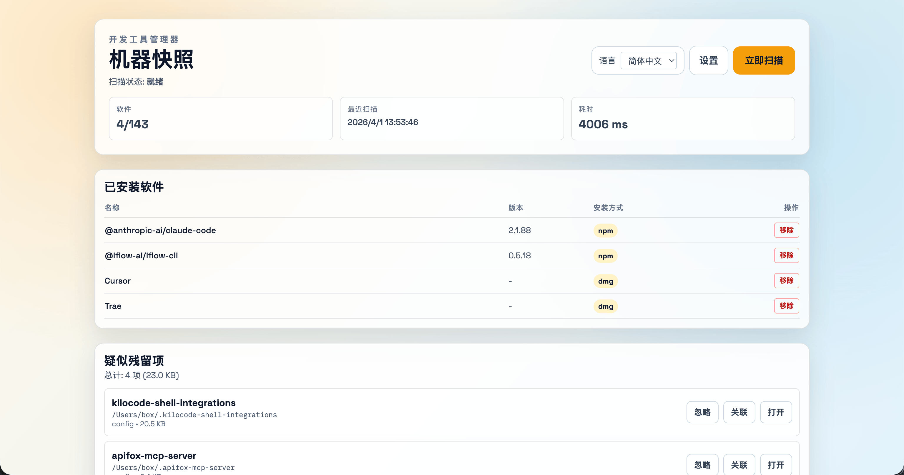
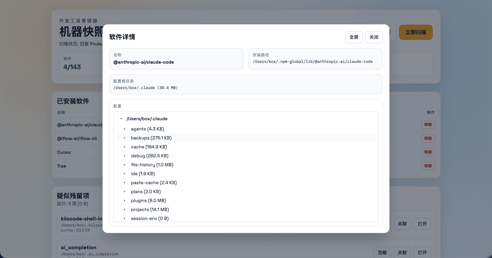
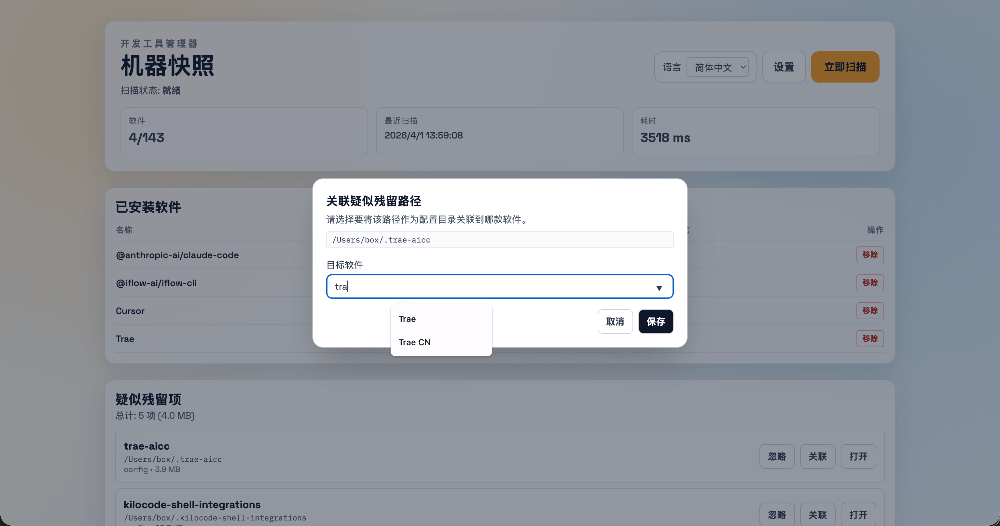
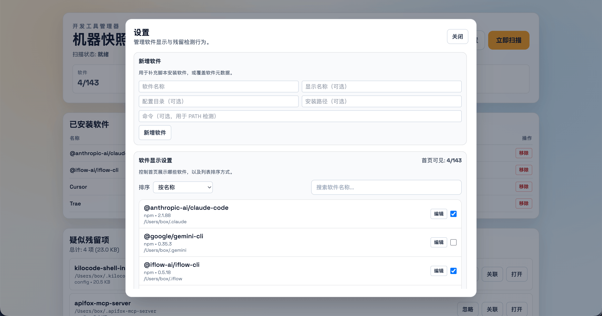
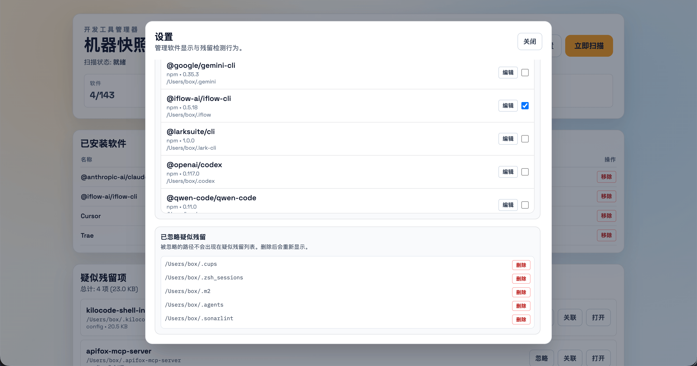

[English](./README.en.md) | [中文版](./README.md)

# Dev Tool Manager

针对 macOS 开发者的专业本地仪表盘，帮助你编目、管理及清理 AI 编程工具（及其他 CLI 工具）留下的配置痕迹。

## 🚀 项目概述

在 AI 工具爆发式进化的今天，开发者经常尝试各种 AI 助手（Claude Code, Cursor, Windsurf, Aider 等）。这些工具通常会在你的家目录留下大量的配置文件、历史记录和缓存模型，导致磁盘空间杂乱不堪。

**Dev Tool Manager** 旨在自动发现系统中的这些工具，为它们的配置提供统一视图，并识别已卸载软件留下的“孤儿”残留件，让你重新掌控磁盘空间。

<div style="display:flex;overflow-x:auto;gap:1rem;margin:1rem 0;">
  
  
  
  
  
</div>

## ✨ 核心功能

- **自动化发现**：扫描 `/Applications`、Homebrew、npm、pip 以及 `PATH` 环境变量，自动汇总已安装工具。
- **AI 工具适配**：内置对 Claude Code, Cursor, Windsurf, Continue, Aider, Tabnine, Codeium, Supermaven 等主流 AI 编程工具的深度识别。
- **残留检测**：智能识别已卸载软件留下的孤儿配置目录。
- **交互式配置管理**：直观查看配置文件树，一键复制路径，直接在 Finder 或终端中打开目录。
- **智能关联**：对于通过脚本或二进制直接安装的工具，支持手动关联其配置路径。
- **完全国际化**：支持简体中文和英文。

## 🛠 开发环境

- **macOS** (支持 Intel 和 Apple Silicon 架构自动适配)
- **Node.js 18+**
- **npm** (包管理)

## 📦 快速开始

```bash
# 克隆仓库
git clone https://github.com/mr-box/dev-tool-manager.git
cd dev-tool-manager

# 安装依赖并启动
npm install
npm run dev
```

启动完成后访问 `http://localhost:5173`。

## ⚙️ 修改配置

将 `.env.example` 复制为 `.env` 进行自定义：

| 变量名 | 说明 | 默认值 |
| --- | --- | --- |
| `CLIENT_PORT` | Vite 开发服务器端口 | `5173` |
| `SERVER_PORT` | Fastify API 服务器端口 | `3456` |
| `SERVER_HOST` | 后端绑定地址 | `127.0.0.1` |
| `CORS_ORIGIN` | 允许的跨域来源 | 默认本地端口 |

## 📂 项目结构

```text
dev-tool-manager/
├── client/              # React 前端 (Vite + Tailwind CSS + i18next)
│   ├── src/components/  # UI 组件 (弹窗, 表格, 列表)
│   ├── src/api.ts       # 后端服务交互层
│   └── src/utils.ts     # 前端格式化与 UI 辅助函数
├── server/              # Fastify 后端
│   ├── scanner/         # 高层扫描调度器
│   │   ├── index.ts     # 聚合与去重核心逻辑
│   │   └── scanners/    # 插件化扫描器 (Homebrew, npm, pip 等)
│   ├── residues.ts      # 基于启发式算法的残留检测
│   └── settings.ts      # 用户偏好持久化
├── shared/              # 前后端共享类型与规范化逻辑
├── scripts/             # 并行开发的启动脚本
└── tests/               # Node.js 原生测试用例
```

## 🤝 贡献指南

欢迎任何形式的贡献！请阅读 [贡献指南](./CONTRIBUTING.md) 了解详细的工作流。

## 📄 许可证

基于 MIT 许可证分发。详见 `LICENSE` 文件。

---
*注：本项目设计为本地管理工具。为了安全起见，后端默认仅监听 `127.0.0.1`。*
